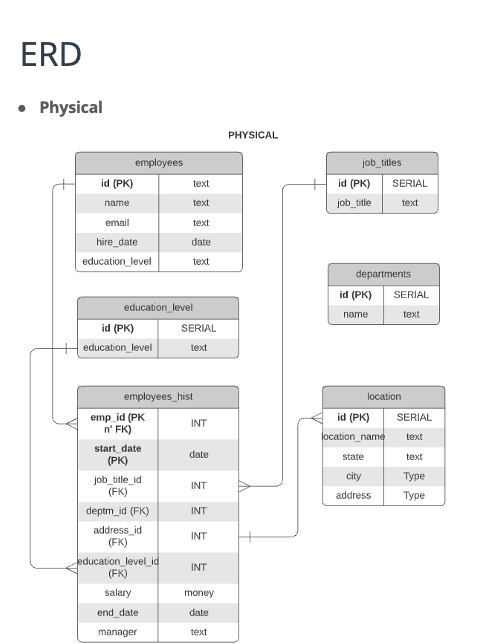
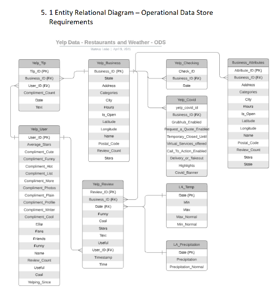
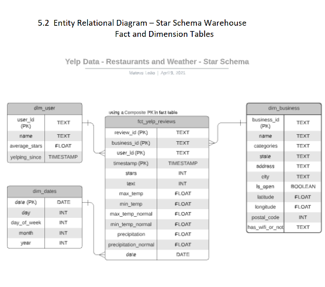
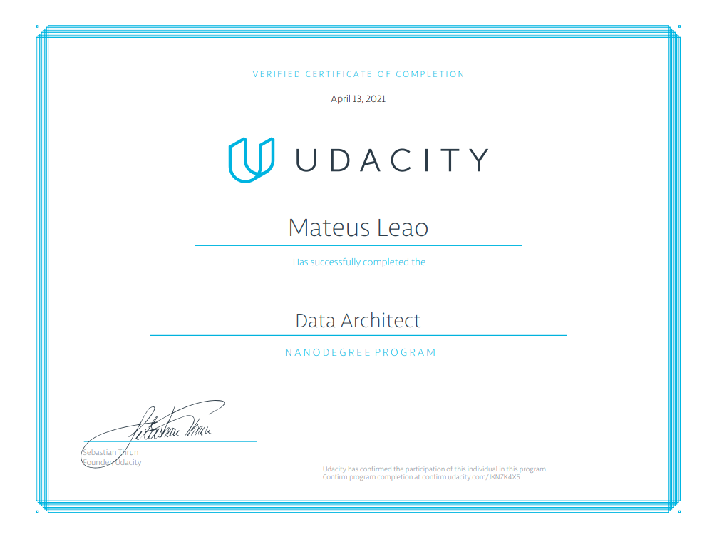

# Udacity Data Architect NanoDegree

## Modelling, ERDs, SQL, Snowflake, Data Lakes, Hadoop, Hive, Spark, Governance

## Some Code you'll find here:
PostgreSQL Schemas and ETLs, plus ERDs  
Snowflake CLI Commands and SQL for Snowflake, plus ERDs 
Some mapReduce with Java 
Hadoop (HDFS, Hive, Pig) 
Python (Spark and Apache Hudu for Data Lakes)

### The projects for this course were:

1) Designing a HR Database in PostgreSQL (OLTP) 
### HR Application ERD (3rd Normal Form)

3) Designing a Datawarehouse solution in Snowflake (OLAP)  

### Yelp Reviews RDS ERD:

### Yelp Reviews DWH ERD (Star Schema):

5) Designing a Cloud Data Lake Architecture (AWS) 
6) Designing a Data Governance Solution for a dummie company

# Certificate

